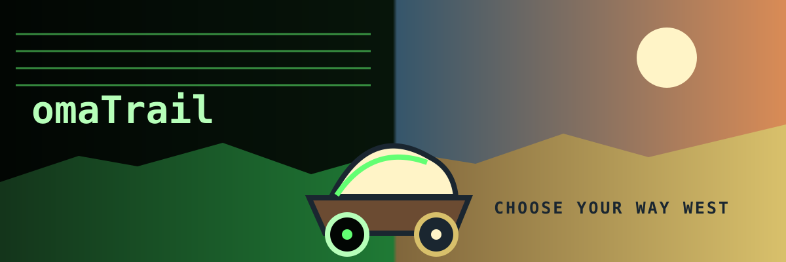
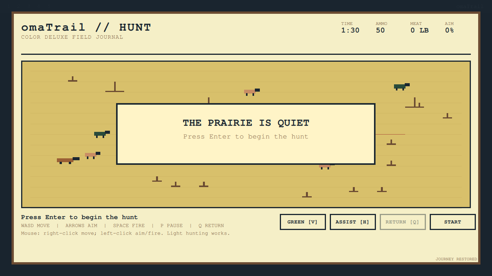
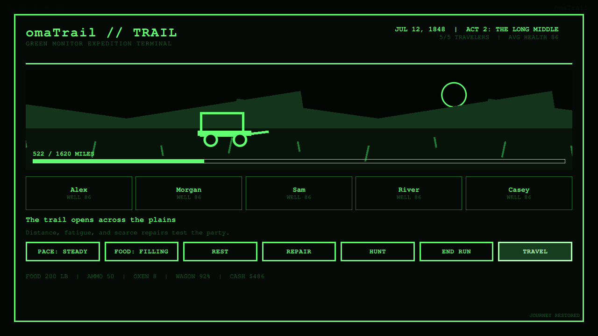
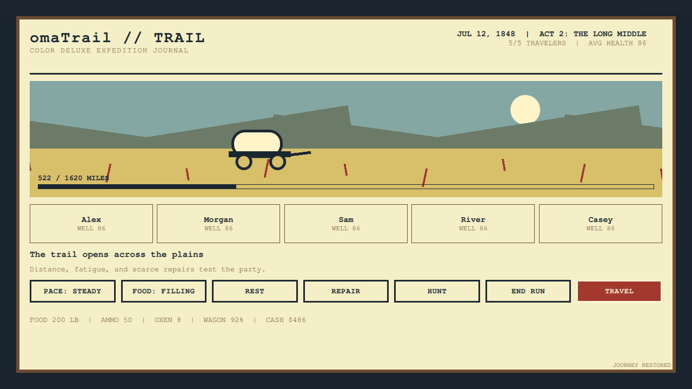
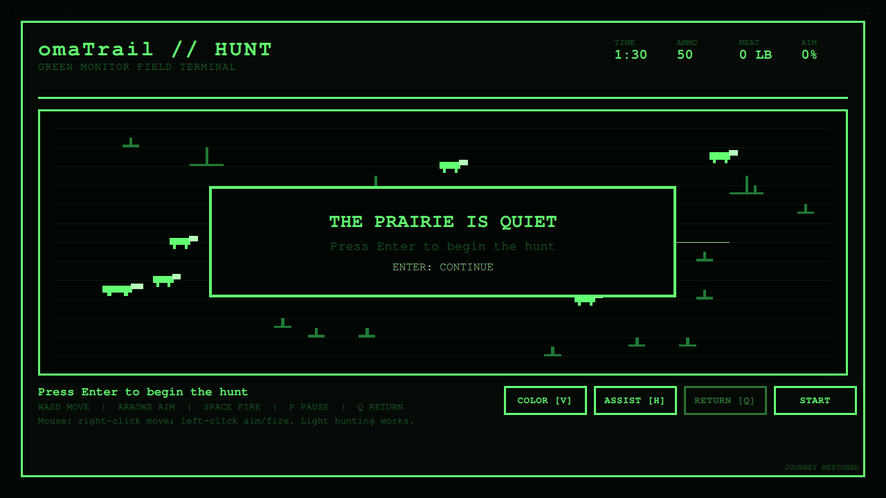
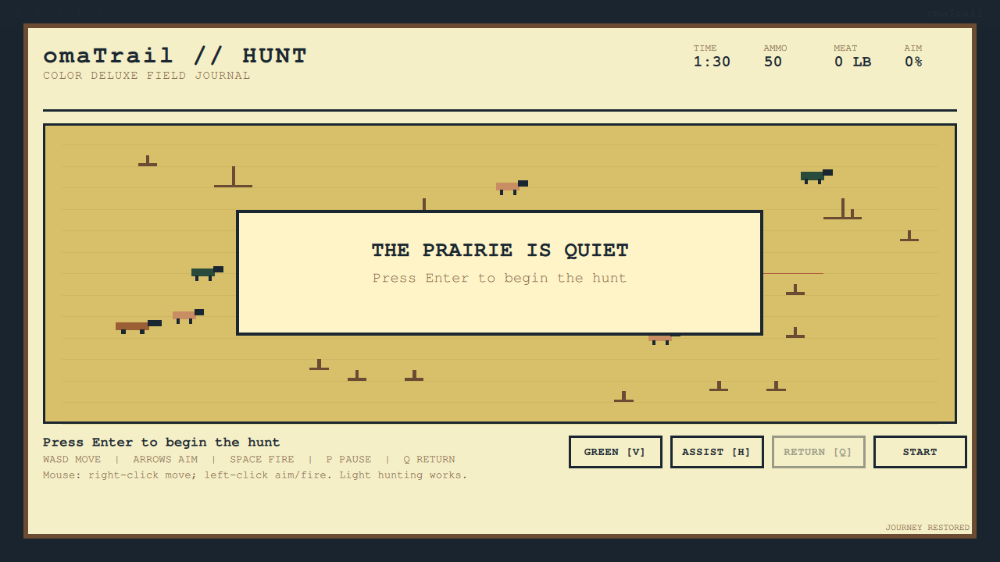

# omaTrail

[](CHANGELOG.md)
[](https://omarchy.org)
[](#privacy-and-saves)
[](LICENSE)

<p align="center">
  
</p>

> Choose your way west.

omaTrail is an offline frontier survival game built directly into the Omarchy
shell. Open it from the bar, name a party of five, outfit a wagon, cross rivers,
survive trail events, and hunt moving wildlife on the way to West Valley.

<p align="center">
  <a href="evidence/render-matrix/color-hunt.png">
    
  </a>
  <br>
  <sub>Live 1280x720 capture from the Buzz Omarchy rig. Click for the full image.</sub>
</p>

## Two looks, one trail

Switch between Green Monitor and Color Deluxe at any point, including during a
hunt. Both profiles use the same deterministic rules and save file, so the
choice is entirely visual.

| Green Monitor | Color Deluxe |
| --- | --- |
| [](evidence/render-matrix/green-trail.png) | [](evidence/render-matrix/color-trail.png) |
| [](evidence/render-matrix/green-hunt.png) | [](evidence/render-matrix/color-hunt.png) |

See the complete real-shell gallery for
[events](evidence/render-matrix/color-event.png),
[river crossings](evidence/render-matrix/green-river.png), and
[endings](evidence/render-matrix/color-ending.png).

## The journey

Lead five travelers across a 1,620-mile fictional composite route in 1848.
Your choices shape who reaches West Valley and what it costs to get there.

1. **Leaving the Known** - Buy supplies at East Camp, judge the crossing at Oak
   Fork, and learn whether preparation can survive first contact with the trail.
2. **The Long Middle** - Cross the plains while distance, fatigue, disagreement,
   storms, and scarce repairs grind down the party.
3. **Last High Country** - Face the route's hardest river, mountain injuries,
   dry country, and the accumulated consequences of every earlier decision.

The route and characters are original fictional composites. omaTrail does not
claim to reproduce one specific historic journey.

## Gameplay

- Five named travelers with health, fatigue, morale, and survival state
- Four occupations, three difficulty levels, and four departure months
- An outfitter selling oxen, food, ammunition, clothing, medicine, and parts
- Pace, rations, weather, wagon wear, oxen fatigue, rest, and repairs
- Eight authored event types with decisions and lasting consequences
- Three river crossings with visible width, depth, current, and weather
- Real-time hunting with moving wildlife, aiming, ammunition, carry limits,
  spoilage, waste, expedition cost, and optional aim assist
- Victory and loss summaries with survivors, losses, duration, resources,
  avoidable waste, score, and replay seed

## Install

Once the repository is public, install and enable it with Omarchy:

```bash
omarchy-plugin-add https://github.com/jeremylongshore/omarchy-omatrail-entry --enable
```

For local development, copy the runtime files from a clean checkout:

```bash
install -d "$HOME/.config/omarchy/plugins/omatrail"
cp -R BarWidget.qml Overlay.qml JourneyView.qml TrailScene.qml HuntingBoard.qml \
  OmatrailButton.qml SaveStore.qml JourneyRules.js HuntingRules.js bin manifest.json \
  "$HOME/.config/omarchy/plugins/omatrail/"
```

Restart or reload the Omarchy shell, then add omaTrail to the bar through shell
settings. The manifest ID is `io.github.jeremylongshore.omatrail`.

## Controls

| Context | Keyboard | Pointer |
| --- | --- | --- |
| Anywhere | `V` changes profile | Profile also follows plugin settings |
| Journey | `Esc` closes, `Enter` performs the primary action, `1` to `5` choose event or river options | Choose supplies and trail actions |
| Hunt | `WASD` moves, arrows aim, `Space` fires, `P` or `Esc` pauses, `Q` requests return, `H` toggles assist | Right-click to move; left-click to aim and fire; named controls pause, return, or toggle assist |

## Privacy and saves

omaTrail has no network calls, telemetry, account, daemon, or elevated access.
It stores one bounded JSON save and one last-good backup through a private,
descriptor-bound helper under:

```text
$XDG_STATE_HOME/omarchy/omatrail/
```

If `XDG_STATE_HOME` is unset, it uses
`$HOME/.local/state/omarchy/omatrail/`. New Expedition deletes the primary save
and backup after a completed or abandoned run.

## Verification

```bash
npm ci
npm test
npm run test:race
npm run test:mutation
npm run test:balance
npm run audit
scripts/run-plugin-gates.sh .
```

The real-shell lane uses the Buzz Omarchy rig:

```bash
scripts/rig-verify.sh .
scripts/rig-render.sh . preview.png
scripts/rig-render-matrix.sh . evidence/render-matrix
scripts/rig-runtime-audit.sh .
scripts/approve-preview.sh
```

The offline suite covers deterministic rules, 10,000 hunting fields, hostile
save handling, route and event outcomes, profile invariance, accessibility, and
180 journey-policy simulations. The balance lane runs 100,000 fixed seeds
through the real journey and hunting engines. The Buzz lane validates, lints,
loads, toggles, and captures omaTrail inside a real Omarchy shell.

The retained [render matrix](evidence/render-matrix/README.md) covers hunting,
rivers, events, trail travel, and endings in both visual modes. The runtime lane
also proves hunting timers pause while hidden, resume safely, and restore the
exact persisted state after a shell restart.

## Product blueprint

The companion umbrella repository holds the Intent Blueprint source of truth:
[project brief](https://github.com/intent-solutions-io/omarchy-plugins/blob/docs/omatrail-blueprint/000-docs/005-PP-PROD-omatrail-project-brief.md),
[requirements](https://github.com/intent-solutions-io/omarchy-plugins/blob/docs/omatrail-blueprint/000-docs/006-PP-BREQ-omatrail-product-requirements.md),
[architecture](https://github.com/intent-solutions-io/omarchy-plugins/blob/docs/omatrail-blueprint/000-docs/007-AT-ARCH-omatrail-system-architecture.md),
[game experience](https://github.com/intent-solutions-io/omarchy-plugins/blob/docs/omatrail-blueprint/000-docs/008-AT-DSGN-omatrail-game-experience.md),
and [test plan](https://github.com/intent-solutions-io/omarchy-plugins/blob/docs/omatrail-blueprint/000-docs/010-TQ-TEST-omatrail-test-plan.md).

## Contributing and support

See [CONTRIBUTING.md](CONTRIBUTING.md) for development rules,
[SUPPORT.md](SUPPORT.md) for help, and [SECURITY.md](SECURITY.md) for private
vulnerability reporting.

## License

MIT. See [LICENSE](LICENSE).
